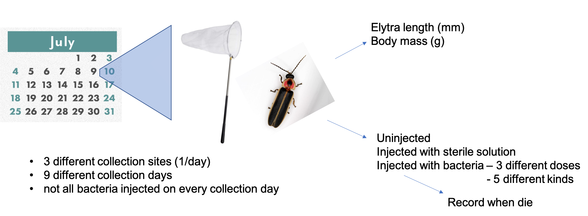

# Goal: Test common assumptions about firefly size (**elytron length** and **body mass**) over the **season** and across **locations** in *P. pyralis* fireflies

*Study design:*



---

## Step 1: Ready the workspace
```{r ready the workspace, message=FALSE}
#clear all inputs
rm(list = ls())

#Check for necessary packages
#list.of.packages <- c("ggplot2", 
#                      "tidyr",
#                      "dplyr",
#                      "Hmisc",
#                      "qqplotr",
#                      "ggthemes",
#                      "fabricatr",
#                      "gridExtra",
#                      "grid",
#                      "kableExtra",
#                      "sjPlot",
#                      "cowplot",
#                      "ggpubr",
#                      "patchwork",
#                      "magick", #so you can use the savekable function
#                      "webshot", #so you can use the savekable function
#                      "lme4",
#                      "RcppEigen")

#should install packages that you don't have
#new.packages <- list.of.packages[!(list.of.packages %in% installed.packages()[,"Package"])]
#if(length(new.packages)) install.packages(new.packages)

#Load the package that contains the Cox Propotional Hazard Function
library(ggplot2)
library(tidyr)
library(dplyr)
library(Hmisc)
library(qqplotr)
library(ggthemes)
library(fabricatr)
library(gridExtra)
library(grid)
library(kableExtra)
library(sjPlot)
library(cowplot)
library(ggpubr)
library(patchwork)
```

---

## Step 2: Import the data
```{r import the data, results = 'hide'}
#This imports the data from a CSV file and creates the data frame PrTC
Adult_Final<-read.table("2021_Adult_Firefly_Survival_binned3.csv", header=TRUE, sep=",", dec=".",na.strings=".") 

#This sets up the color palette using tableau20: https://jrnold.github.io/ggthemes/reference/tableau_color_pal.html
site_colors <- c("USA: Montour Co, Bucknell Natural Area" = "#4E79A7", 
                 "USA: Union Co, Bucknell Farm" = "#F28E2B", 
                 "USA: Union Co, Bucknell Ropes Course" = "#E15759")
```

**Data Used:**
  
  + `r nrow(Adult_Final)` fireflies with elytra length (calipers),  body mass (analytical balance), and survival data.
  
Abbreviations used:

  + BNA = Bucknell Natural Area
  + BUF = Bucknell University Farm
  + FDBCC = Forrest D. Brown Conference Center
  
---

## Step 3: Initial Analysis

### **Elytron length**

#### Q1. What does the length distribution look like overall?

 + **Raw data** (left) vs **log-transformed** (right)
```{r elytron length distributions, message = FALSE, fig.align="center", fig.width=7, fig.height=3}
#generate distribution of raw data
z <- ggplot(Adult_Final, aes(x=ElytralLength)) +
  geom_histogram() +
  xlab("Elytron length (mm)") +
  ylab("N fireflies") +
  theme(plot.title = element_text(hjust = 0.5))

#generate log distribution plot
y <- ggplot(Adult_Final, aes(x=log(ElytralLength))) +
  geom_histogram() +
  xlab("log(Elytron length) (mm)") +
  ylab("N fireflies") +
  theme(plot.title = element_text(hjust = 0.5))

grid.arrange(z, y, nrow= 1)
```

#### Q2. ...by location?
 + Data summary (untransformed):
```{r elytron length by location table, message=FALSE}
#generate tibble
t<- Adult_Final %>% 
  group_by(Location) %>% 
  summarise(N=n(), mean_length=round(mean(ElytralLength),2), SD = round(sd(ElytralLength), 2))

#generate nice looking table
kbl(t, col.names = c("Location", "n", "Mean elytron length (mm)", "SD"), align = "lccc") %>%
  kable_classic(full_width = F, html_font = "Cambria")
```

 + Raw data, three different ways:
```{r elytron length by site figures, message=FALSE, fig.align="center"}
#generate labels for sites that include sample size
site_labels = c(paste("BNA", " (n = ", t$N[1], ")", sep=""), 
                paste0("BUF", " (n = ", t$N[2], ")"), 
                paste0("FDBCC",  " (n = ", t$N[3], ")"))

#generate text placeholder
a <- ggplot(Adult_Final, aes(x=ElytralLength, fill=Location)) +
  geom_histogram(alpha= 0.5, position="identity") +
  scale_fill_manual(name = "Collection Location", labels = site_labels, values = site_colors)
  
legend.a <- cowplot::get_legend(a)

#generate histogram
b <- ggplot(Adult_Final, aes(x=ElytralLength, fill=Location)) +
  geom_histogram(alpha= 0.5, position="identity") +
  xlab("Elytron length (mm)") +
  ylab("N fireflies") +
  theme(plot.title = element_text(hjust = 0.5), legend.position = "none") +
  scale_fill_manual(name = "Location", labels = site_labels, values = site_colors)

#generate violin plot
c <- ggplot(Adult_Final, aes(x=Location, y=ElytralLength, fill=Location)) +
  geom_violin(alpha = 0.9) +
  theme_classic() +
  ylab("Elytron length (mm)") +
  theme(plot.title = element_text(hjust = 0.5), legend.position = "none", axis.text.x=element_blank(), axis.title.x=element_blank()) +
  geom_boxplot(width=0.2, alpha= 0.5, fill = "white") +
  scale_fill_manual(values = site_colors)

#generate boxplot
d <- ggplot(Adult_Final, aes(x=Location, y=ElytralLength, fill=Location)) +
  geom_boxplot(alpha = 0.9) +
  geom_jitter(size = 0.1)+
  theme_classic() +
  ylab("Elytron length (mm)") +
  theme(plot.title = element_text(hjust = 0.5), legend.position = "none", axis.text.x=element_blank(), axis.title.x=element_blank()) +
  scale_fill_manual(values = site_colors)

grid.arrange(legend.a,b,c,d, nrow=2)
```

#### Q3. ...by seasonday
 + Data summary (untransformed):
```{r elytron length by seasonday summary table 2, message=FALSE}
#generate tibble
t <- Adult_Final %>%
  group_by(Location, SeasonDay) %>%
  summarise(N=n(), mean_length=round(mean(ElytralLength),2), SD = round(sd(ElytralLength),2)) %>%
  arrange(SeasonDay)

#make table nice in kable
kbl(t, col.names = c("Location", "Season Day", "n", "Mean elytron length (mm)", "SD"), align = "lcccc") %>%
  kable_classic(full_width = F, html_font = "Cambria")
```

 + Raw data, three different ways:
```{r elytron length by seasonday plots, message=FALSE, fig.align="center"}
#generate labels for seasondays that include sample size
t$SeasonDayLabel = paste(t$SeasonDay, " (", t$N, ")", sep ="")
  
seasonday_label <- c(
  '9' = t$SeasonDayLabel[1],
  '13' = t$SeasonDayLabel[2],
  '15' = t$SeasonDayLabel[3],
  '17' = t$SeasonDayLabel[4],
  '22' = t$SeasonDayLabel[5],
  '23' = t$SeasonDayLabel[6],
  '30' = t$SeasonDayLabel[7],
  '31' = t$SeasonDayLabel[8],
  '36' = t$SeasonDayLabel[9]
  )

#generate legend
e <- ggplot(Adult_Final, aes(x=ElytralLength, fill=Location)) +
  geom_histogram() +
  xlab("Elytron length (mm)") +
  ylab("N fireflies") +
  theme(plot.title = element_text(hjust = 0.5)) +
  facet_wrap(~SeasonDay, labeller = as_labeller(seasonday_label)) +
  scale_fill_manual(name = "Location", labels = c("BNA", "BUF", "FDBCC"), values = c("#4E79A7", "#F28E2B", "#E15759"))

legend.e <- cowplot::get_legend(e)

#generate histogram
f <- ggplot(Adult_Final, aes(x=log(ElytralLength), fill=Location)) +
  geom_histogram() +
  xlab("Elytron length (mm)") +
  ylab("N fireflies") +
  ggtitle("SeasonDay (n)") +
  theme(plot.title = element_text(hjust = 0.5), legend.position = "none") +
  facet_wrap(~SeasonDay, labeller = as_labeller(seasonday_label), ncol=5) +
  scale_fill_manual(name = "Location", labels = c("BNA", "BUF", "FDBCC"), values = c("#4E79A7", "#F28E2B", "#E15759"))

#generate violin plot by seasonday
g <- ggplot(Adult_Final, aes(x=as.factor(SeasonDay), y=ElytralLength, fill = Location)) +
  geom_violin(alpha = 0.9) +
  theme_classic() +
  ylab("Elytron length (mm)") +
  xlab("Season Day") +
  theme(plot.title = element_text(hjust = 0.5), axis.text.x = element_text(angle = 90), legend.position = "none") +
  geom_boxplot(width=0.2, fill = "white") +
  scale_fill_manual(name = "Location", labels = c("BNA", "BUF", "FDBCC"), values = c("#4E79A7", "#F28E2B", "#E15759"))

#generate violin plot by site
h <- ggplot(Adult_Final, aes(x=as.factor(SeasonDay), y=ElytralLength, fill = Location)) +
  geom_violin(alpha = 0.9) +
  theme_classic() +
  ylab("Elytron length (mm)") +
  xlab("Season Day") +
  theme(plot.title = element_text(hjust = 0.5), legend.position = "none", axis.text.x = element_text(angle = 90)) +
  facet_wrap(~Location, labeller = labeller(Location = 
    c("USA: Montour Co, Bucknell Natural Area" = "BNA",
      "USA: Union Co, Bucknell Farm" = "BUF",
      "USA: Union Co, Bucknell Ropes Course" = "FDBCC"))) +
  geom_boxplot(width=0.2, fill = "white") +
  scale_fill_manual(values = c("#4E79A7", "#F28E2B", "#E15759"))

lay1 <- rbind(c(2,2,2,1))
lay2 <- rbind(c(1,1,2,2,2))

g1 <- arrangeGrob(legend.e, f, layout_matrix = lay1)
g2 <- arrangeGrob(g,h, layout_matrix = lay2)
 
grid.arrange(g1, g2, nrow=2)                  
```

#### Q4. Are the distributions within each Location * SeasonDay normal?
Testing the *raw data:*

  + **Q-Q plot** for the raw data (left) and **Shapiro test** (bottom right)
  
```{r elytron length qq plots, fig.align="left"}
#qq plots to assess normality
q <- ggplot(Adult_Final, aes(sample=ElytralLength, color=Location)) +
  stat_qq_band(bandType = "pointwise", fill = "#8DA0CB", alpha = 0.4) + 
  stat_qq_line(color = "#8DA0CB") +
  stat_qq_point() +
  ggtitle("Season Day") +
  facet_wrap(~SeasonDay) +
  scale_color_manual(name = "Location", labels = c("BNA", "BUF", "FDBCC"), values = c("#4E79A7", "#F28E2B", "#E15759")) +
  theme(legend.position = "none")

#statistically test
shapiro.table <- NULL
for (day in levels(factor(Adult_Final$SeasonDay))){
  #subset table
  table.sub <- Adult_Final[Adult_Final$SeasonDay == day,]
  test.result <- (shapiro.test(table.sub$ElytralLength))
  info <- data.frame(SeasonDay = day, W = round(test.result[1]$statistic, 2), p = round(test.result[2]$p.value, 2))
  shapiro.table <- rbind(shapiro.table, info)
}

#create kable filename
kable_filename = paste("Elytron_length_shapiro", ".png", sep="")

#generate nice table with kable
kbl(shapiro.table, row.names = FALSE, col.names = c("Season Day", "W", "P"), align = "ccc")  %>%
  kable_classic(full_width = F, html_font = "Cambria") %>% 
  save_kable(file = kable_filename, bs_theme = "cerulean", zoom = 7) 

#make big plot with table
#read in kable table as image
r <- ggdraw() +
  draw_image(kable_filename)

#stack the legend on top of the table
g3 <- arrangeGrob(legend.e, r, nrow =2)

#make the column width layout
shapiro_layout <- rbind(c(1,1,1,2))

#plot the graph next to the legend and table
grid.arrange(q, g3, nrow = 1,  layout_matrix = shapiro_layout)
```

**Conclusions:**

  + *p* >> 0.05 for elytron length distributions from each collection day, and thus, cannot reject null (normality). 

*This suggests that log transformation is not necessary to satisfy statistical assumptions of a linear relationship between the response variable (elytron length) and explanatory variables (season day, location) when looking at how these variables are related. However, log transformation is the standard when comparing body size metrics due to allometric scaling expectations. Thus, we will proceed with testing whether log transformation of elytron length alters expected linear relationships among variables (specifically body mass and survival). The fits may be no different or even better.*

#### Q5. Does log-transformation change things?
Testing **log-transformed data:**

  + **Q-Q plot** for the log-transformed data (left) and **Shapiro test** (bottom right)

```{r log elytron length qq plots, fig.align="left"}
#qq plots to assess normality
q <- ggplot(Adult_Final, aes(sample=log(ElytralLength), color=Location)) +
  stat_qq_band(bandType = "pointwise", fill = "#8DA0CB", alpha = 0.4) + 
  stat_qq_line(color = "#8DA0CB") +
  stat_qq_point() +
  ggtitle("Season Day") +
  facet_wrap(~SeasonDay) +
  scale_color_manual(name = "Location", labels = c("BNA", "BUF", "FDBCC"), values = c("#4E79A7", "#F28E2B", "#E15759")) +
  theme(legend.position = "none")

#statistically test
shapiro.table <- NULL
for (day in levels(factor(Adult_Final$SeasonDay))){
  #subset table
  table.sub <- Adult_Final[Adult_Final$SeasonDay == day,]
  test.result <- (shapiro.test(log(table.sub$ElytralLength)))
  info <- data.frame(SeasonDay = day, W = round(test.result[1]$statistic, 2), p = round(test.result[2]$p.value, 2))
  shapiro.table <- rbind(shapiro.table, info)
}

#create kable filename
kable_filename = paste("log_Elytron_length_shapiro", ".png", sep="")

#generate nice table with kable
kbl(shapiro.table, row.names = FALSE, col.names = c("Season Day", "W", "P"), align = "ccc")  %>%
  kable_classic(full_width = F, html_font = "Cambria") %>% 
  save_kable(file = kable_filename, bs_theme = "cerulean", zoom = 7) 

#make big plot with table
#read in kable table as image
r <- ggdraw() +
  draw_image(kable_filename)

#stack the legend on top of the table
g3 <- arrangeGrob(legend.e, r, nrow =2)

#make the column width layout
shapiro_layout <- rbind(c(1,1,1,2))

#plot the graph next to the legend and table
grid.arrange(q, g3, nrow = 1,  layout_matrix = shapiro_layout)
```

**Conclusions:**

  + *p* < 0.05 for log elytron length distributions from one collection day, and thus, reject normality. Two others (day 13 and day 23) are close (p = 0.08 and p = 0.06, respectively). Day 13 likely has smaller sample size (BUF). Thus, most days are consistent with normal distribution.
  + Since the distributions more frequently depart from normality, we will use untransformed (raw) elytron length in analyses investigating relationships with Season Day and Location, but will also investigate the effects of log transformation in elytron length by body mass comparisons. Perhaps transformation will not make a big difference. Most sample sizes are > 30, meaning they are large enough for parametric tests anyway.

#### Q6. Do seasonday and location predict elytron length?

 + Summary of effects:
```{r elytron length model test, fig.align='center'}
Elytral<-lm(ElytralLength~SeasonDay*Location, data=Adult_Final)
summary(Elytral)
```

 + ANOVA(model) results:
```{r  elytron length anova}
kbl(anova(Elytral), digits = 2)  %>%
  kable_classic(full_width = F, html_font = "Cambria")
```

 + For **Elytron length**, only the interaction term (**SeasonDay:Location**) is significant (p = 0.02).

#### Conclusion

  + Use log-transformed elytron length in downstream analysis when using elytron length as an explanatory variable rather than a response variable with respect to variation in body mass due to allometric scaling.
  + **Season Day** doesn't really matter for elytron length (this is expected if elytron length is fixed for the life of adult).
  + **Location** doesn't really matter (caveats: sampling efforts at sites were not equal and non-randomly distributed across the season) 
  + **SeasonDay:Location** is significant. This is apparent if you look at the violin plots for Season Day grouped by Location. There is a downward trend in BNA, but not in the others. However, the sample size (replicate sampling events at a particular site across the season) is small (BNA = sampled 3 times in the first half of the season, BUF = sampled twice, FDBCC = sampled 4 times, all in second half of season).
  + **Side Note:** Vencl and Carlson (1998) (https://www.proquest.com/docview/757065622?accountid=9784) found a bimodal distribution in elytron length at their sites on Long Island across season (July), no effect of year (3 field seasons) so these were all pooled in the distribution displayed in the manuscript. They log-transformed elytron length for their analysis, and the plot displays the untransformed data.

 + Plots:
    + Blue: BNA
    + Red: BUF
    + Gold: FDBCC

##### Overall plot
```{r elytron length plot for interactions, fig.align="center", fig.width=5, fig.height=3}

#plot with all locations over the season
p_elytral_length_by_season_day <- ggplot(Adult_Final, aes(x=as.numeric(SeasonDay), y=ElytralLength, color = Location)) +
  geom_point(size = 1, alpha = 0.7) +
  theme_classic() +
  ylab("Elytron length (mm)") +
  xlab("Season Day") +
  theme(plot.title = element_text(hjust = 0.5), axis.text.x = element_text(angle = 90), legend.position = "none") +
  scale_color_manual(name = "Location", labels = c("BNA", "BUF", "FDBCC"), values = c("#4E79A7", "#F28E2B", "#E15759"))

p_elytral_length_by_season_day
```

##### Investigating individual locations
###### BNA
  + Stats:
```{r elytron length stats over the season - BNA}
#BNA
Elytral_BNA<-lm(ElytralLength~SeasonDay, data=Adult_Final[Adult_Final$Location == "USA: Montour Co, Bucknell Natural Area",])
summary(Elytral_BNA)
```

```{r elytron length plot over the season - BNA, message=FALSE, fig.align="center", fig.width=3.5, fig.height=3}
p_elytral_length_by_season_day_BNA <- ggplot(Adult_Final[Adult_Final$Location == "USA: Montour Co, Bucknell Natural Area",], aes(x=as.numeric(SeasonDay), y=ElytralLength)) +
  geom_point(size = 1, alpha = 0.7, color = "#4E79A7") +
  theme_classic() +
  ylab("Elytron length (mm)") +
  xlab("Season Day") +
  theme(plot.title = element_text(hjust = 0.5), axis.text.x = element_text(angle = 90), legend.position = "none") +
  geom_smooth(method = "lm", se=FALSE, color = "gray23") +
  stat_regline_equation(label.x = 17, label.y = 11.4, aes(label = ..eq.label..)) +
  stat_regline_equation(label.x = 17, label.y = 11.0, aes(label = ..rr.label..)) +
  ggtitle("BNA")

#p_elytral_length_by_season_day_BNA
```

###### BUF
  + Stats:
```{r elytron length stats over the season - BUF}
Elytral_BUF<-lm(ElytralLength~SeasonDay, data=Adult_Final[Adult_Final$Location == "USA: Union Co, Bucknell Farm",])
summary(Elytral_BUF)
```

```{r elytron length plot over the season - BUF, message=FALSE, fig.align="center", fig.width=3.5, fig.height=3}
p_elytral_length_by_season_day_BUF <- ggplot(Adult_Final[Adult_Final$Location == "USA: Union Co, Bucknell Farm",], aes(x=as.numeric(SeasonDay), y=ElytralLength)) +
  geom_point(size = 1, alpha = 0.7, color = "#F28E2B") +
  theme_classic() +
  ylab("Elytron length (mm)") +
  xlab("Season Day") +
  theme(plot.title = element_text(hjust = 0.5), axis.text.x = element_text(angle = 90), legend.position = "none") +
  ggtitle("BUF")

#p_log_elytral_length_by_season_day_BUF
```

###### FDBCC
  + Stats:
```{r elytron length stats over the season - FDBCC}
Elytral_FDBCC<-lm(ElytralLength~SeasonDay, data=Adult_Final[Adult_Final$Location == "USA: Union Co, Bucknell Ropes Course",])
summary(Elytral_FDBCC)
```

```{r elytron length plot over the season - FDBCC, message=FALSE, fig.align="center", fig.width=3.5, fig.height=3}
p_elytral_length_by_season_day_FDBCC <- ggplot(Adult_Final[Adult_Final$Location == "USA: Union Co, Bucknell Ropes Course",], aes(x=as.numeric(SeasonDay), y=ElytralLength)) +
  geom_point(size = 1, alpha = 0.7, color = "#E15759") +
  theme_classic() +
  ylab("Elytron length (mm)") +
  xlab("Season Day") +
  theme(plot.title = element_text(hjust = 0.5), axis.text.x = element_text(angle = 90), legend.position = "none")  +
  ggtitle("FDBCC")

#p_log_elytral_length_by_season_day_FDBCC
```

###### Plots
```{r elytron length by location over the season plots, fig.align="center", fig.width=11, fig.height=3, message = FALSE}
p_elytral_length_by_season_day_BNA + p_elytral_length_by_season_day_BUF + p_elytral_length_by_season_day_FDBCC
```

**Conclusions:**

  + elytron length decreases over the season at BNA (p = 0.03), with 3 sampling days
  + doesn't have an effect at BUF (p = 0.1), but only 2 sampling days
  + doesn't have an effect at FDBCC (p = 0.7), with 4 sampling days
  + additional replicated sampling days at each site, preferably distributed across the season, are required to further investigate this trend

### **Body mass**

#### Q1. What does the mass distribution look like overall?

 + **Raw data** (left) vs **log-transformed** (right)
```{r body mass distributions, message = FALSE, fig.align="center", fig.width=7, fig.height=3}
#generate distribution of raw data
z <- ggplot(Adult_Final, aes(x=Mass)) +
  geom_histogram() +
  xlab("Body mass (g)") +
  ylab("N fireflies") +
  theme(plot.title = element_text(hjust = 0.5))

#generate log distribution plot
y <- ggplot(Adult_Final, aes(x=log(Mass))) +
  geom_histogram() +
  xlab("log(Body mass) (g)") +
  ylab("N fireflies") +
  theme(plot.title = element_text(hjust = 0.5))

grid.arrange(z, y, nrow= 1)
```

#### Q2. ...by location?
 + Data summary (untransformed):
```{r raw body mass by location table , message=FALSE}
#generate tibble 
t<- Adult_Final %>% 
  group_by(Location) %>% 
  summarise(N=n(), mean_mass=round(mean(Mass),4), SD = round(sd(Mass), 4))

#generate nice looking table
kbl(t, col.names = c("Location", "n", "Mean body mass (g)", "SD"), align = "lccc") %>%
  kable_classic(full_width = F, html_font = "Cambria")
```
 
 + Log-transformed data, three different ways:
```{r log(body mass) by location plots, message=FALSE, fig.align="center"}
#generate sample size labels
site_labels = c(paste("BNA", " (N=", t$N[1], ")", sep=""), 
                paste0("BUF", " (N=", t$N[2], ")"), 
                paste0("FDBCC",  " (N=", t$N[3], ")"))

#generate text placeholder
i <- ggplot(Adult_Final, aes(x=log(Mass), fill=Location)) +
  geom_histogram(alpha= 0.5, position="identity") +
  scale_fill_manual(name = "Collection Location", labels = site_labels, values = site_colors)
  
legend.i <- cowplot::get_legend(i)

#generate histogram with log mass
j <- ggplot(Adult_Final, aes(x=log(Mass), fill=Location)) +
  geom_histogram(alpha= 0.5, position="identity") +
  xlab("log(Body mass) (g)") +
  ylab("N fireflies") +
  theme(plot.title = element_text(hjust = 0.5), legend.position = "none") +
  scale_fill_manual(name = "Location", labels = site_labels, values = site_colors)

#generate violin plot with log mass
k <- ggplot(Adult_Final, aes(x=Location, y=log(Mass), fill=Location)) +
  geom_violin(alpha = 0.9) +
  theme_classic() +
  ylab("log(Body mass) (g)") +
  theme(plot.title = element_text(hjust = 0.5), legend.position = "none", axis.text.x=element_blank(), axis.title.x=element_blank()) +
  geom_boxplot(width=0.2, alpha= 0.5, fill = "white") +
  scale_fill_manual(values = site_colors)

#generate boxplot
l <- ggplot(Adult_Final, aes(x=Location, y=log(Mass), fill=Location)) +
  geom_boxplot(alpha = 0.9) +
  geom_jitter(size = 0.1)+
  theme_classic() +
  ylab("log(Body mass) (g)") +
  theme(plot.title = element_text(hjust = 0.5), legend.position = "none", axis.text.x=element_blank(), axis.title.x=element_blank()) +
  scale_fill_manual(values = site_colors)

grid.arrange(legend.i,j,k,l, nrow=2)
```

#### Q3. ...by seasonday

 + Data summary (untransformed):
```{r log body mass by seasonday table, message=FALSE}
#generate tibble
t <- Adult_Final %>%
  group_by(Location, SeasonDay) %>%
  summarise(N=n(), mean_mass=round(mean(Mass),4), SD = round(sd(Mass),4)) %>%
  arrange(SeasonDay)

#make table nice in kable
kbl(t, col.names = c("Location", "Season Day", "n", "Mean body mass (g)", "SD"), align = "lcccc") %>%
  kable_classic(full_width = F, html_font = "Cambria")
```
 
 + Log-transformed data, three different ways:
```{r log body mass by seasonday plots, message=FALSE, fig.align="center"}
#generate labels for seasondays that include sample size
t$SeasonDayLabel = paste(t$SeasonDay, " (", t$N, ")", sep ="")

seasonday_label <- c(
  '9' = t$SeasonDayLabel[1],
  '13' = t$SeasonDayLabel[2],
  '15' = t$SeasonDayLabel[3],
  '17' = t$SeasonDayLabel[4],
  '22' = t$SeasonDayLabel[5],
  '23' = t$SeasonDayLabel[6],
  '30' = t$SeasonDayLabel[7],
  '31' = t$SeasonDayLabel[8],
  '36' = t$SeasonDayLabel[9]
  )

#generate histogram
m <- ggplot(Adult_Final, aes(x=log(Mass), fill=Location)) +
  geom_histogram() +
  xlab("log(Body mass) (g)") +
  ylab("N fireflies") +
  theme(plot.title = element_text(hjust = 0.5)) +
  facet_wrap(~SeasonDay, labeller = as_labeller(seasonday_label)) +
  scale_fill_manual(name = "Location", labels = c("BNA", "BUF", "FDBCC"), values = c("#4E79A7", "#F28E2B", "#E15759")) 

#generate legend
legend.m <- cowplot::get_legend(m)

#generate histogram
n <- ggplot(Adult_Final, aes(x=log(Mass), fill=Location)) +
  geom_histogram() +
  xlab("log(Body mass) (g)") +
  ylab("N fireflies") +
  ggtitle("Season Day (n)") +
  theme(plot.title = element_text(hjust = 0.5), legend.position = "none") +
  facet_wrap(~SeasonDay, labeller = as_labeller(seasonday_label), ncol = 5) +
  scale_fill_manual(name = "Location", labels = c("BNA", "BUF", "FDBCC"), values = c("#4E79A7", "#F28E2B", "#E15759")) 

#generate violin plot by seasonday
o <- ggplot(Adult_Final, aes(x=as.factor(SeasonDay), y=log(Mass), fill = Location)) +
  geom_violin(alpha = 0.9) +
  theme_classic() +
  ylab("log(Body mass) (g)") +
  xlab("Season Day") +
  theme(plot.title = element_text(hjust = 0.5), axis.text.x = element_text(angle = 90), legend.position = "none") +
  geom_boxplot(width=0.2, fill = "white") +
  scale_fill_manual(name = "Location", labels = c("BNA", "BUF", "FDBCC"), values = c("#4E79A7", "#F28E2B", "#E15759"))

#generate violin plot by site
p <- ggplot(Adult_Final, aes(x=as.factor(SeasonDay), y=log(Mass), fill = Location)) +
  geom_violin(alpha = 0.9) +
  theme_classic() +
  ylab("log(Body mass) (g)") +
  xlab("Season Day") +
  theme(plot.title = element_text(hjust = 0.5), legend.position = "none", axis.text.x = element_text(angle = 90)) +
  facet_wrap(~Location, labeller = labeller(Location = 
    c("USA: Montour Co, Bucknell Natural Area" = "BNA",
      "USA: Union Co, Bucknell Farm" = "BUF",
      "USA: Union Co, Bucknell Ropes Course" = "FDBCC"))) +
  geom_boxplot(width=0.2, fill = "white") +
  scale_fill_manual(values = c("#4E79A7", "#F28E2B", "#E15759"))

lay1 <- rbind(c(2,2,2,1))
lay2 <- rbind(c(1,1,2,2,2))

g3 <- arrangeGrob(legend.m, n, layout_matrix = lay1)
g4 <- arrangeGrob(o,p, layout_matrix = lay2)
 
grid.arrange(g3, g4, nrow=2)   
```

#### Q4. Are the distributions within each Site * SeasonDay normal?

Testing the **raw data:**

 + **Q-Q plots** for the raw data (left) and **Shapiro test** (bottom right)
```{r raw body mass qq plots, fig.align="center"}
#qq plots to assess normality with raw data
q <- ggplot(Adult_Final, aes(sample=Mass, color=Location)) +
  stat_qq_band(bandType = "pointwise", fill = "#8DA0CB", alpha = 0.4) + 
  stat_qq_line(color = "#8DA0CB") +
  stat_qq_point() +
  facet_wrap(~SeasonDay) +
  scale_color_manual(name = "Location", labels = c("BNA", "BUF", "FDBCC"), values = c("#4E79A7", "#F28E2B", "#E15759")) +
  theme(legend.position = "none")

#statistically test
shapiro.table <- NULL
for (day in levels(factor(Adult_Final$SeasonDay))){
  #subset table
  table.sub <- Adult_Final[Adult_Final$SeasonDay == day,]
  test.result <- (shapiro.test(table.sub$Mass))
  info <- data.frame(SeasonDay = day, W = round(test.result[1]$statistic, 2), p = round(test.result[2]$p.value, 2))
  shapiro.table <- rbind(shapiro.table, info)
}

#generate kable filename
kable_filename = paste("Body_mass_raw_shapiro", ".png", sep="")

#generate nice table with kable
kbl(shapiro.table, row.names = FALSE, col.names = c("Season Day", "W", "P"), align = "ccc")  %>%
  kable_classic(full_width = F, html_font = "Cambria") %>%
  save_kable(file = kable_filename, bs_theme = "cerulean", zoom = 7)

#read in kable table as image
r <- ggdraw() +
  draw_image(kable_filename)

#stack the legend on top of the table
g3 <- arrangeGrob(legend.e, r, nrow =2)

#make the column width layout
shapiro_layout <- rbind(c(1,1,1,2))

#plot the graph next to the legend and table
grid.arrange(q, g3, nrow = 1,  layout_matrix = shapiro_layout)

```

 **Conclusions:** Not normal (5/9 days):

  + Day 13
  + Day 15
  + Day 17
  + Day 23
  + Day 31

*However, sample size is large on these days - only Day 30 (not included in list of collections that violate normality) has sample size < 30. Next, test log-transformed data to see if improves.*

#### Q5. Does log-transformation help?

*Note: Log-transformation of body mass is necessary for the assumption of linearity in survival models (see Methods in main text)*

Testing **log-transformed data:**

 + **Q-Q plots** for the log-transformed data (left) and **Shapiro test** (bottom right)
```{r log body mass qq plots, fig.align="center"}
#qq plots to assess normality
q <- ggplot(Adult_Final, aes(sample=log(Mass), color=Location)) +
  stat_qq_band(bandType = "pointwise", fill = "#8DA0CB", alpha = 0.4) + 
  stat_qq_line(color = "#8DA0CB") +
  stat_qq_point() +
  facet_wrap(~SeasonDay) +
  scale_color_manual(name = "Location", labels = c("BNA", "BUF", "FDBCC"), values = c("#4E79A7", "#F28E2B", "#E15759")) +
  theme(legend.position = "none")

#statistically test
shapiro.table <- NULL
for (day in levels(factor(Adult_Final$SeasonDay))){
  #subset table
  table.sub <- Adult_Final[Adult_Final$SeasonDay == day,]
  test.result <- (shapiro.test(log(table.sub$Mass)))
  info <- data.frame(SeasonDay = day, W = round(test.result[1]$statistic, 2), p = round(test.result[2]$p.value, 2))
  shapiro.table <- rbind(shapiro.table, info)
}

#generate kable table filename
kable_filename = paste("Body_mass_log_shapiro", ".png", sep="")
  
#generate nice table with kable
kbl(shapiro.table, row.names = FALSE, col.names = c("Season Day", "W", "P"), align = "ccc")  %>%
  kable_classic(full_width = F, html_font = "Cambria") %>%
  save_kable(file = kable_filename, bs_theme = "cerulean", zoom = 7)

#read in kable table as image
r <- ggdraw() +
  draw_image(kable_filename)

#stack the legend on top of the table
g3 <- arrangeGrob(legend.e, r, nrow =2)

#make the column width layout
shapiro_layout <- rbind(c(1,1,1,2))

#plot the graph next to the legend and table
grid.arrange(q, g3, nrow = 1,  layout_matrix = shapiro_layout)
```

**Conclusions:** 

 + Yes - *P* >> 0.05 for log body mass distributions from each collection day, fail to reject normality.

#### Q6. Do seasonday and location predict body mass?

 + Summary of effects:
```{r log body mass model testing}
#no Elytral length; + interaction
Mass<-lm(log(Mass)~SeasonDay*Location, data=Adult_Final)
summary(Mass)
```

 + ANOVA(model) results:
```{r}
#anova(Mass) #interaction term NS, SeasonDay p = 0.008244

#display results as nice table with kable
kbl(anova(Mass), digits = 2)  %>%
  kable_classic(full_width = F, html_font = "Cambria")
```

+ **SeasonDay** is significant (p = 0.01)

#### Conclusion

  + Use log-transformed mass in downstream analysis
  
  + Mass decreases over the **season** (potentially reflects using up energy reserves, desiccation). 

  + Plot for multi-panel figure
```{r log body mass plot for multi-panel fig for main text, fig.align="center", fig.width=3.5, fig.height=3, message=FALSE}

p_body_mass_by_season_day <- ggplot(Adult_Final, aes(x=as.numeric(SeasonDay), y=log(Mass))) +
  geom_point(aes(color = Location), size = 1, alpha = 0.7) +
  geom_smooth(method = "lm", se=FALSE, color = "gray23") +
  theme_classic() +
  ylab("log(Body mass) (g)") +
  xlab("Season Day") +
  theme(plot.title = element_text(hjust = 0.5), axis.text.x = element_text(angle = 90), legend.position = "none") +
  scale_color_manual(name = "Location", labels = c("BNA", "BUF", "FDBCC"), values = c("#4E79A7", "#F28E2B", "#E15759")) + stat_regline_equation(label.x = 23, label.y = -2.8, aes(label = ..eq.label..)) +
  stat_regline_equation(label.x = 23, label.y = -2.6, aes(label = ..rr.label..))

p_body_mass_by_season_day
```

### **Length & Mass**

#### Q1. Accounting for allometry (log-log), does elytron length predict body mass? 

 + Summary
```{r log(length) vs log(mass) summary}
Both<-lm(log(Mass)~log(ElytralLength), data=Adult_Final)
summary(Both)
```

  + ANOVA
```{r log(length) vs log(mass) anova}
kbl(anova(Both), row.names = TRUE, digits = 130) %>%
  kable_classic(full_width = F, html_font = "Cambria")
```

 + Plot
```{r log(length) vs log(mass) plot, message=FALSE, fig.width=3.5, fig.height=3}
#using ggpubr package to get equations on graphs
#SOURCE: https://www.roelpeters.be/how-to-add-a-regression-equation-and-r-squared-in-ggplot2/
p_body_mass_by_elytron_length <- ggplot(Adult_Final,aes(x = log(ElytralLength), y = log(Mass))) + 
  geom_point(data = Adult_Final, aes(color = Location), size = 1, alpha = 0.7) + 
  geom_smooth(method = "lm", se=FALSE, color = "gray23") +
  theme_classic() + 
  stat_regline_equation(label.y = -2.75, aes(label = ..eq.label..)) +
  stat_regline_equation(label.y = -2.87, aes(label = ..rr.label..)) +
  scale_color_manual(name = "Location", labels = c("BNA", "BUF", "FDBCC"), values = c("#4E79A7", "#F28E2B", "#E15759")) +
  theme(legend.position = "none") +
  ylab("log(Body mass) (g)") +
  xlab("log(Elytron length) (mm)")

p_body_mass_by_elytron_length
```

#### Q2. If account for log(elytron length) first in the model, do Season Day and/or Location predict body mass? 

  + Summary of effects:
```{r}
#including interaction, but restricting to 2nd order interactions due to small sample size
Mass<-lm(log(Mass)~log(ElytralLength)*SeasonDay*Location, data=Adult_Final)
summary(Mass)
```

 + ANOVA:
```{r}
kbl(anova(Mass), row.names = TRUE, digits = 130) %>%
  kable_classic(full_width = F, html_font = "Cambria")
```

#### Conclusions

 + **log(Elytron length)** sig. correlated with **body mass**, but can't explain everything (v small p, r^2 = 0.49) 
 + **Location** and **SeasonDay** significant when **elytra length** accounted for


  + Question: take residuals as "adult reserves" measurement?
    + no -> see Darlington, R. B., and T. V. Smulders. 2001. Problems with residual analysis. Anim. Behav. 62:599–602.

---

### Combined multi-plot visualizing main results
```{r combined plot for initial analysis, message=FALSE, fig.align='center', fig.height= 8, fig.width = 12}
#using patchwork
#get the plots together
multiplot <- p_elytral_length_by_season_day_BNA + p_elytral_length_by_season_day_BUF + p_elytral_length_by_season_day_FDBCC + p_body_mass_by_season_day + p_body_mass_by_elytron_length

#add annotations and layouts
w <- multiplot + plot_annotation(tag_levels = 'A') + plot_layout(widths = unit(c(3),c("in")), heights = unit(c(2), c("in")), guides = "collect") & theme(legend.position = 'bottom')

w

#ggsave("FigS1.EL_Mass_analysis.png", w, width = 12, height = 8, device = "png")
```

---

## Step 4: Session Info
```{r session info}
sessionInfo()
```

---
